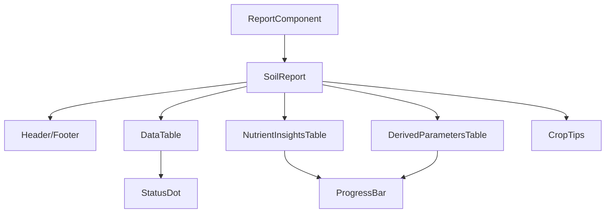

# Soil Analysis Report Generator

A React application that generates professional PDF reports for soil analysis using `@react-pdf/renderer`. This system creates comprehensive soil analysis reports with multiple sections, tables, and visual elements.

## 🎯 Overview

This application generates detailed soil analysis reports with the following features:
- **Dynamic data input** for farmer information and soil parameters
- **Professional PDF layout** with headers, footers, and consistent styling
- **Multiple report sections** with tables, progress bars, and visual indicators
- **Responsive preview** with download functionality
- **Modular component architecture** for easy maintenance

## 📁 Project Structure

```
src/
├── pdf/                          # PDF generation system
│   ├── components/               # Reusable UI components
│   │   ├── Header.jsx           # PDF header with logo and title
│   │   ├── Footer.jsx           # PDF footer with branding and page numbers
│   │   ├── StatusDot.jsx        # Colored status indicator dot
│   │   └── ProgressBar.jsx      # Visual progress bar for fertility ratings
│   ├── tables/                  # Table components for data display
│   │   ├── DataTable.jsx       # Main soil analysis parameters table
│   │   ├── NutrientInsightsTable.jsx    # Detailed nutrient insights with progress bars
│   │   ├── DerivedParametersTable.jsx   # Status of other derived parameters
│   │   └── CropTips.jsx         # Crop-specific tips table
│   ├── utils/                   # Utility files and shared resources
│   │   └── theme.js             # Colors, fonts, and shared styling
│   ├── SoilReport.jsx           # Main PDF document orchestrator
│   ├── ReportComponent.jsx      # React component for PDF preview and download
│   └── README.md               # PDF system documentation
├── App.jsx                      # Main application component
└── main.jsx                     # Application entry point
```

## 🔧 How It Works

### 1. **Data Flow Architecture**



### 2. **PDF Generation Process**

#### **Step 1: Data Input**
```jsx
// ReportComponent.jsx - Data preparation
const reportData = {
  name: 'Prabhakant Singh',
  mobile: '6388011997',
  location: 'Kanpur Dehat',
  // ... more farmer data
};

const tableRows = [
  { name: 'pH', ideal: '6.5 – 7.5', actual: '7.2', statusColor: '#22C55E' },
  // ... more soil parameters
];
```

#### **Step 2: PDF Document Structure**
```jsx
// SoilReport.jsx - Main document orchestrator
<Document>
  <Page> {/* Section 1: Soil Analysis Parameters */}
  <Page> {/* Section 2: Detailed Nutrient Insights */}
  <Page> {/* Section 3: Status of Other derived parameters */}
  <Page> {/* Section 4: Crop Tips */}
  <Page> {/* Section 5: Disclaimer */}
</Document>
```

#### **Step 3: Component Rendering**
- **Header/Footer**: Fixed on every page
- **Tables**: Dynamic data rendering with styling
- **Progress Bars**: Visual fertility ratings
- **Status Dots**: Color-coded indicators

### 3. **Key Technologies**

#### **@react-pdf/renderer**
- **PDFDocument**: Main document wrapper
- **Page**: Individual pages with size and styling
- **View, Text, Image**: Layout and content components
- **StyleSheet**: PDF-specific styling system
- **PDFViewer**: Live preview component
- **PDFDownloadLink**: Download functionality

#### **React Hooks**
- **useState**: Component state management
- **useMemo**: Optimized document generation

#### **Vite Configuration**
- **Buffer polyfill**: Required for @react-pdf/renderer
- **Build optimization**: Fast development and production builds

## 📄 Report Sections

### **Section 1: Soil Analysis Parameters**
- **Farmer Information**: Name, mobile, location, village
- **Farm Details**: Previous crop, farm size, next crop
- **Sample Information**: Date, sample code, treatment type
- **Main Data Table**: pH, EC, OC, Nitrogen, Phosphorus, etc.
- **Derived Parameters**: C:N Ratio, CEC Tendency, Ca:Mg Ratio, K:Mg Ratio

### **Section 2: Detailed Nutrient Insights**
- **Progress Bar Visualization**: Fertility ratings with Low/Medium/High indicators
- **Nutrient Explanations**: What each parameter means
- **Crop Growth Functions**: How nutrients affect plant development

### **Section 3: Status of Other Derived Parameters**
- **Visual Progress Bars**: Color-coded fertility ratings
- **Parameter Meanings**: Detailed explanations
- **Crop Growth Impact**: Function in plant development

### **Section 4: Crop Tips**
- **Stage-based Recommendations**: Before planting, at planting, vegetative, etc.
- **Best Practices**: Expert cultivation advice
- **Why It Matters**: Scientific explanations

### **Section 5: Disclaimer**
- **Legal Information**: Report limitations and usage guidelines

## 🎨 Styling System

### **Theme Configuration**
```jsx
// utils/theme.js
export const colors = {
  brand: '#124B2F',      // Dark green brand color
  tableHeader: '#124B2F', // Table header background
  border: '#D1D5DB',     // Border color
  good: '#22C55E',       // Green for good status
  warn: '#F59E0B',       // Orange for medium status
  bad: '#EF4444'         // Red for low status
};
```

### **Component Styling**
- **Consistent colors** across all components
- **Professional typography** with proper font sizes
- **Responsive layouts** with flexbox
- **Visual hierarchy** with proper spacing

## 🚀 Usage

### **Basic Implementation**
```jsx
import { PDFViewer, PDFDownloadLink } from '@react-pdf/renderer';
import SoilReport from './pdf/SoilReport';

function App() {
  return (
    <PDFViewer>
      <SoilReport 
        logoUrl="https://example.com/logo.jpg"
        title="Soil Doctor"
        reportData={reportData}
        tableRows={tableRows}
      />
    </PDFViewer>
  );
}
```

### **Data Structure**
```jsx
const reportData = {
  name: 'Farmer Name',
  mobile: 'Phone Number',
  location: 'Location',
  village: 'Village',
  previousCrop: 'Previous Crop',
  farmSize: 'Farm Size',
  farmName: 'Farm Name',
  nextCrop: 'Next Crop',
  dateOfCollection: '2024-01-01',
  sampleCode: 'S0001234',
  treatmentType: 'Organic'
};

const tableRows = [
  {
    name: 'Parameter Name',
    ideal: 'Ideal Range',
    actual: 'Actual Value',
    assessment: 'Status Text',
    statusColor: '#22C55E'
  }
];
```

## 🔧 Development

### **Installation**
```bash
npm install
```

### **Development Server**
```bash
npm run dev
```

### **Build**
```bash
npm run build
```

### **Key Dependencies**
- **@react-pdf/renderer**: PDF generation
- **buffer**: Polyfill for Vite compatibility
- **React**: UI framework
- **Vite**: Build tool

## 📊 Features

### **Visual Elements**
- **Progress Bars**: Fertility rating visualization
- **Status Dots**: Color-coded indicators
- **Professional Tables**: Clean, readable data presentation
- **Consistent Branding**: Logo and color scheme

### **Layout Features**
- **Fixed Headers/Footers**: Consistent across all pages
- **Responsive Design**: Adapts to content length
- **Page Breaks**: Smart content distribution
- **Professional Typography**: Clear, readable fonts

### **Data Management**
- **Dynamic Content**: Easy data updates
- **Flexible Structure**: Modular component system
- **Type Safety**: Consistent data handling
- **Error Handling**: Graceful fallbacks

## 🎯 Benefits

- **Professional Output**: High-quality PDF reports
- **Easy Maintenance**: Modular component architecture
- **Scalable Design**: Easy to add new sections
- **Consistent Branding**: Unified visual identity
- **User-Friendly**: Simple data input and preview
- **Performance Optimized**: Fast rendering and downloads

This system provides a complete solution for generating professional soil analysis reports with a clean, maintainable codebase and excellent user experience.
